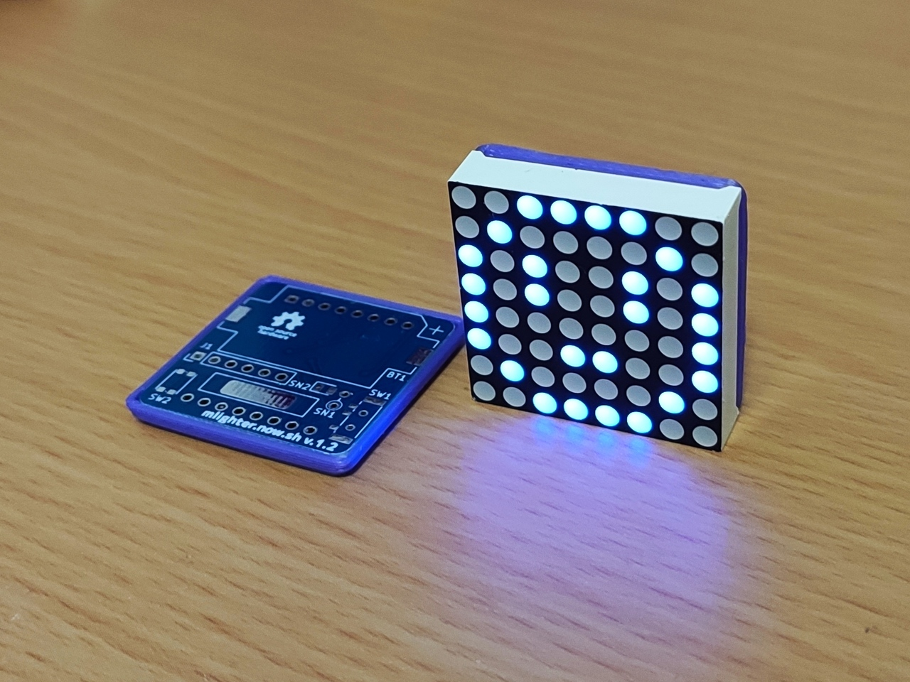

  

# MLIGHTER
[An optically re-writable](https://mlighter.now.sh/) tiny LED badge.

## Project structure
- [`pio/`](./pio) - Source code of the firmware(PlatformIO)
- [`kicad/`](./kicad) - PCB design (KiCad)
- [`openscad/`](./openscad) - Models for the 3D-printable jig. (OpenSCAD)
- https://github.com/likeablob/mlighter-webui - Source code of the Web UI(Nuxt.js + Vuetify)

## Build Instructions
WIP

## BOM
| Name               | Description      | Amount | Price   |
| ------------------ | ---------------- | ------ | ------- |
| ATiny85 (SOIC)     | uC               | 1      | ~1 USD  |
| MAX7219            | LED Driver       | 1      | 0.2 USD |
| SFH3710            | Photo Transistor | 1      | 0.2 USD |
| 8x8 LED Dot Matrix | (32x32mm)        | 1      | ~1 USD  |
| CR2032             | Coin Cell        | 1      | -       |

## Refs
WIP